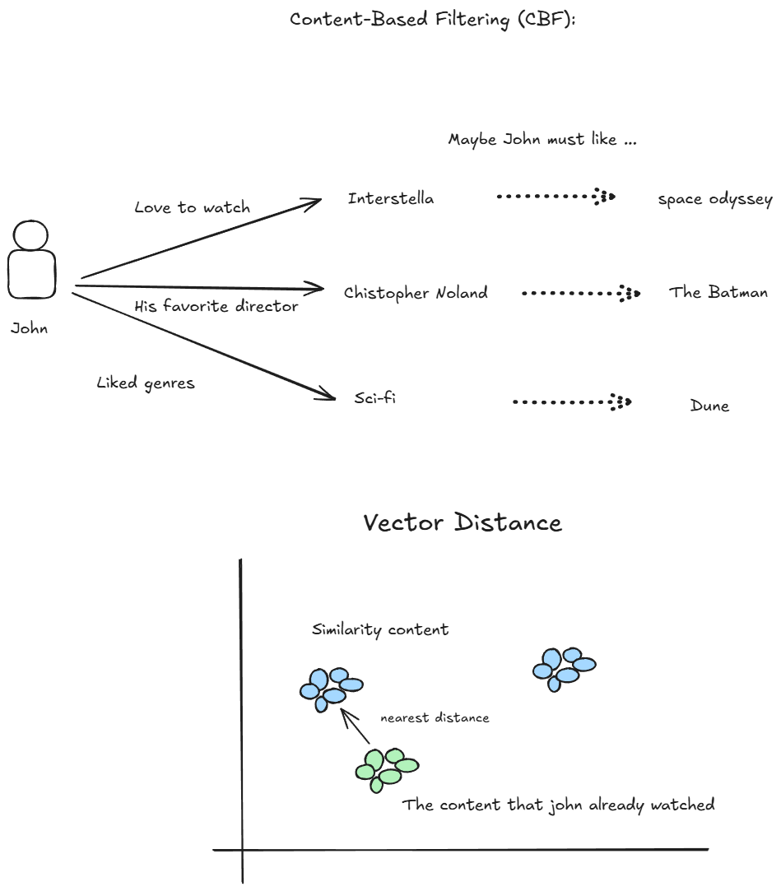
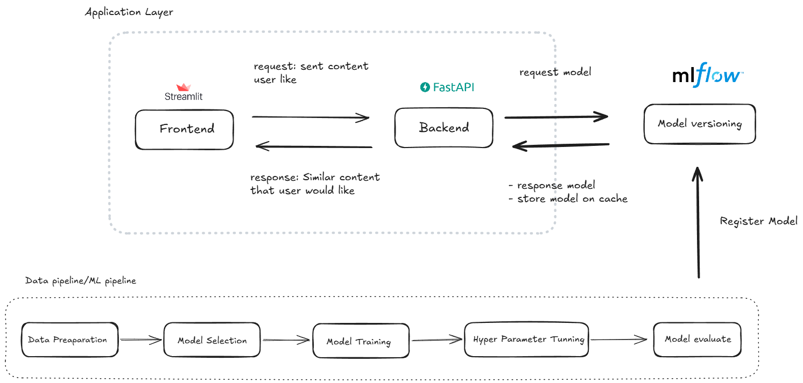
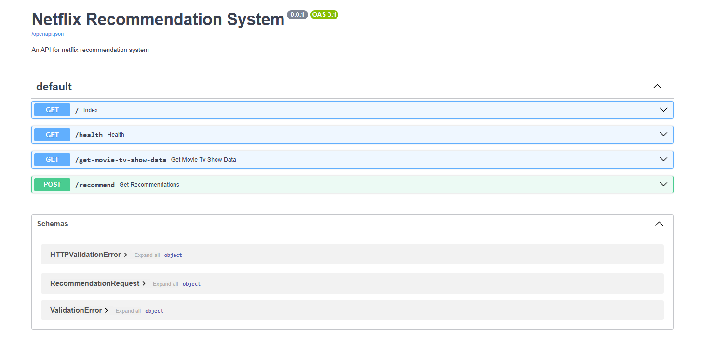
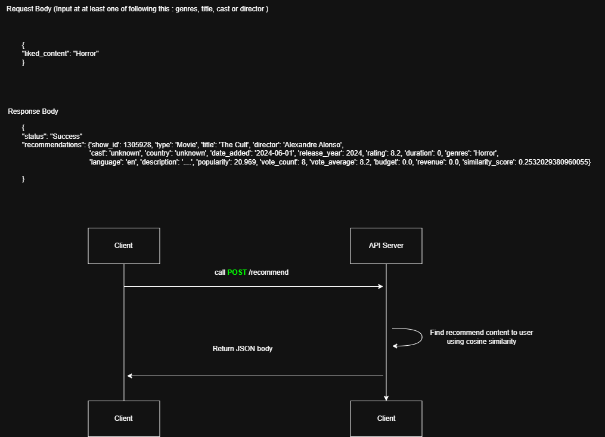
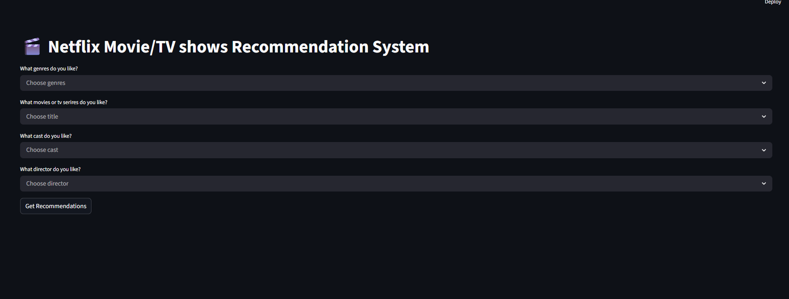
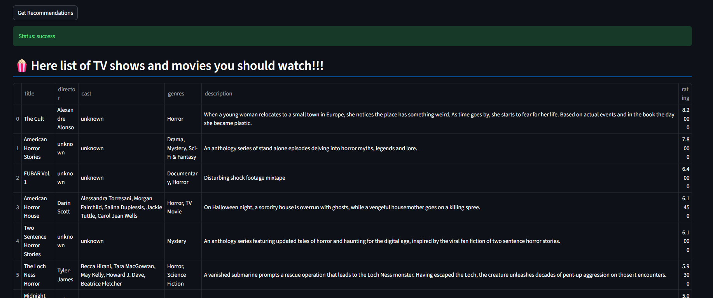

# 🎬 Netflix Recommendation System (Assessment)

This repository for Netflix recommendation system assessment to show how design ML system, ML architecture and ML infrastructure.

| Overview | |
|---|---|
| **Runtime** | 

## 🤖 Approach and Method to Get Recommend

I utilized **TF-IDF Vectorization** and **Cosine Similarity** to match user nearest to content that similar to user content.



## 🏗 ML System Architecture Overview

This system is built using a microservice architecture, separating the MLOps tracking, the inference engine, and the user interface.

* **Tracking Server:** `MLflow` for experiment tracking, parameter logging, and model registry.
* **Backend API:** `FastAPI` serving a Custom PyFunc MLflow model.
* **Frontend UI:** `Streamlit` for interactive user querying and result presentation.
* **Deployment:** Multi-stage `Docker Compose` to orchestrates service.



### API Layer



### Example input/output how api works
* Endpoint: **POST** /recommend
* Request Body
``` json
{
"liked_content": "Horror"
}
```
* Response Body
``` json
{

"status": "Success"
"recommendations": {"show_id": 1305928, "type": "Movie", "title": "The Cult", "director": "Alexandre Alonso",  "cast": "unknown", "country": "unknown", "date_added": "2024-06-01", "release_year": 2024,"rating": 8.2, "duration": 0, "genres": "Horror", "language": "en", "description": "....", "popularity": 20.969, "vote_count": 8, "vote_average": 8.2, "budget": 0.0, "revenue": 0.0, "similarity_score": 0.2532029380960055}
}
```



## 📂 Repository Structure

```text
tv_recommender_project/
├── .dockerignore                                         # Ignored in docker build stage
├── .gitignore                                            # Ignored things that will not push to repo
├── frontend_prototype                                    # Streamlit UI
├── research-movie-series-recomendation.ipynb             # Experiment data and model
├── train.py                                              # Data pipeline and ml pipeline and store model on mlflow
├── main.py                                               # FastAPI backend and schemas
├── Dockerfile                                            # Multi-stage build for the backend
├── Dockerfile.frontend                                   # Multi-stage build for the prototype UI
├── docker-compose.yml                                    # Orchestrates backend, Frontend, and MLflow
├── requirements.txt                                      # Python backend environment dependencies
├── requirement.frontend.txt                              # Python frontend environment dependencies
├── requirement.training.txt                              # Python experiment environment dependencies
└── README.md                                             # Project documentation
```

## Prototype UI

the prototype UI show how the application work

* ### Home Page



* ### Home Page



## 💭How to improve in the future

The system on this repository still on prototype concept, it need a lot to imporve the system.

**Model Improvement** to improve accurate recommendation
* **Collaborative Filtering** The implmented model on this repository solved only cold start problem (Not quite accurate), but for another problem like warm sart problem, this system still not handle this.
* **Regression Model** to predict rating list of recommned movies and tv shows that user will give.
* **Classification Model** After sent list of recommned movies and tv shows to user, predict user will watch or not.
* **Two-Tower Neural Network Model** when need to scale for handle million of users, TF-IDF Vectorization and Cosine Similarity can not handle this scale, must develop Two-Tower neural network model to predict recommend value.

**System Improvement**
* **Vector Database** for search engine to serach movies and tv showns in milli seconds
* **Relational Database** to store user information or history, these information will make easier to predict what content user will like.
* **Feast** for feature store
* **S3 storage** for store dataset and data versioning
* **Frontend Framework** moving from prototype framework like streamlit to enterpise frontend framework such as React, Angular, etc.

* **infrastructure Improvement**
** **CI/CD/CT** for automate intregation test, easily deployment and continuous training, the model will refresh easily when it need to retrain on time.
** **Kubernetes** to horizental scale service and handle milions of users in future
** **Observability** to check ML system performance by checking metrics, logs and tracing of the service
** **ML monitoring** to check ML behvior for example data diff, concept diff, etc.


## For Development

* You can start application by run via docker compose after you cloned this repository

```bash
docker compose up --build
```

### Backend Development

1. Create virtual environment for backend. 

```bash
py -3.12 -m venv .venv
```

2. Install python dependencies for backend environment
```bash
pip install requirements.txt
```

## Frontend Development

1. Create virtual environment for frontend. 

```bash
py -3.12 -m venv .venv
```

2. Install python dependencies for frontend environment
```bash
pip install requirement.frontend.txt
```

## Experiment

1. Create virtual environment for experiment. 

```bash
py -3.12 -m venv .venv
```

2. Install python dependencies for experiment environment.

```bash
pip install requirement.frontend.txt
```